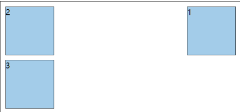
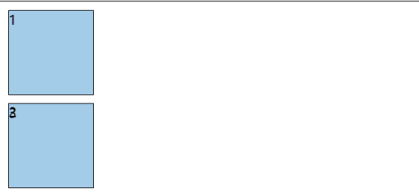
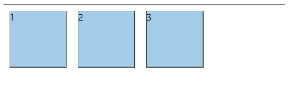
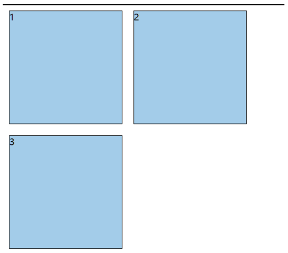
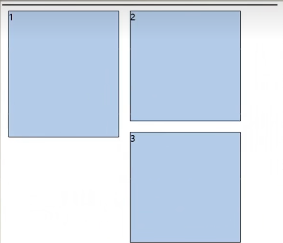
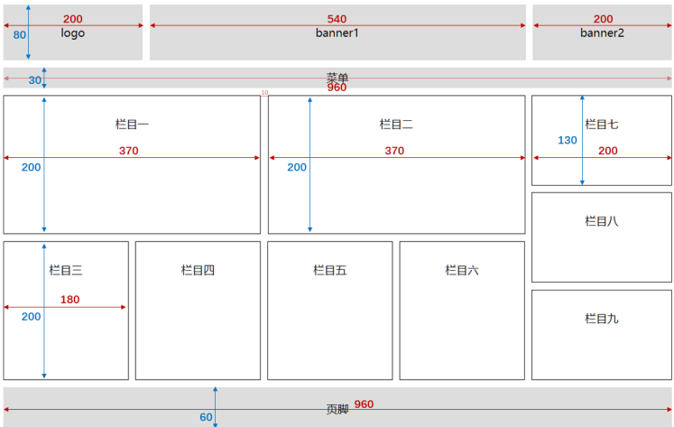

# 浮动
## 浮动的简介
在最初，浮动是用来实现文字环绕图片效果的，现在浮动是主流的页面布局方式之一


## 元素浮动后的特点
1. 🤢脱离文档流。
2. 😊不管浮动前是什么元素，浮动后：默认宽与高都是被内容撑开（尽可能小），而且可以设置宽高。
3. 😊不会独占一行，可以与其他元素共用一行。
4. 😊不会 margin 合并，也不会 margin 塌陷，能够完美的设置四个方向的 margin 和 padding 。
5. 😊不会像行内块一样被当做文本处理（没有行内块的空白问题）


## 浮动小练习
+ 练习1：盒子1右浮动，效果如下
```css
.outer {
	width: 500px;
	background-color: gray;
	border: 1px solid black;
}
.box {
	width: 100px;
	height: 100px;
	background-color: skyblue;
	border: 1px solid black;
	margin: 10px
}
.box1 {
	float: right;
}
```



+ 练习2：盒子1左浮动，效果如下
```css
.outer {
	width: 500px;
	background-color: gray;
	border: 1px solid black;
}
.box {
	width: 100px;
	height: 100px;
	background-color: skyblue;
	border: 1px solid black;
	margin: 10px
}
.box1 {
	float: left;
}
```



+ 练习3：所有盒子都浮动，效果如下
```css
.outer {
	width: 500px;
	background-color: gray;
	border: 1px solid black;
}
.box {
	width: 100px;
	height: 100px;
	background-color: skyblue;
	border: 1px solid black;
	margin: 10px;
	float: left
}
```



+ 练习4：所有盒子浮动后，盒子3落下来，效果如下
```css
.outer {
	width: 500px;
	background-color: gray;
	border: 1px solid black;
}
.box {
	width: 200px;
	height: 200px;
	background-color: skyblue;
	border: 1px solid black;
	margin: 10px;
	float: left
}
```



+ 练习5：所有盒子浮动后，盒子3卡住了，效果如下
```css
.outer {
	width: 500px;
	background-color: gray;
	border: 1px solid black;
}
.box {
	width: 100px;
	height: 100px;
	background-color: skyblue;
	border: 1px solid black;
	margin: 10px
}
.box1 {
	height: 230px;
}
```




## 解决浮动产生的影响
### 元素浮动后会有哪些影响
+ **对兄弟元素的影响**： 后面的兄弟元素，会占据浮动元素之前的位置，在浮动元素的下面；对前面的兄弟无影响。
+ **对父元素的影响**： 不能撑起父元素的高度，导致父元素高度塌陷；但父元素的宽度依然束缚浮动的元素。

### 解决浮动产生的影响(清楚浮动)
解决方案：
1. 方案一： 给父元素指定高度。
2. 方案二： 给父元素也设置浮动，带来其他影响。
3. 方案三： 给父元素设置 `overflow:hidden`
4. 方案四： 在所有浮动元素的最后面，添加一个块级元素，并给该块级元素设置 `clear:both`
5. 方案五： 给浮动元素的父元素，设置伪元素，通过伪元素清除浮动，原理与方案四相同 (推荐使用)
```css
.parent::after {
	content: "";
	display: block;
	clear:both;
}
```

> 布局中的一个原则：设置浮动的时候，兄弟元素要么全都浮动，要么全都不浮动


## 浮动相关属性
+ `float `
+ 功能：设置浮动
+ 属性值
	+ `left` : 设置左浮动
	+ `right` : 设置右浮动
	+ `none` ：不浮动，默认值

+ `clear`
+ 功能：清除浮动，清除前面兄弟元素浮动元素的响应
+ 属性值
	+ `left` ：清除前面左浮动的影响
	+ `right` ：清除前面右浮动的影响
	+ `both` ：清除前面左右浮动的影响


## 浮动布局小练习


~~至于代码嘛... 自己写，这里就不贴了~~